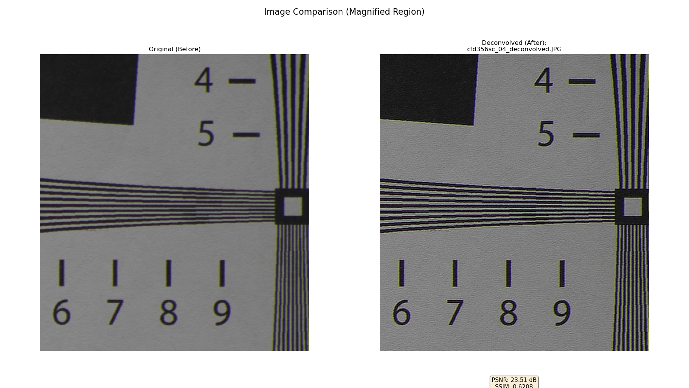

# Vintage Telephoto Lens Deconvolution 

A Python-based graphical tool designed to restore sharpness and correct spherical aberration in images taken with vintage telephoto lenses. By leveraging a user-created Point Spread Function (PSF), this tool can mathematically reverse optical blurring to recover hidden detail.

## The Problem: The Vintage Glow & Softness

If you love shooting with old telephoto or projector lenses, you're familiar with their unique character. Often, this character comes with a dream-like glow, a lack of critical sharpness, and hazy details, especially when shooting wide open. This is frequently caused by **Spherical Aberration (SA)**.

SA is an optical imperfection where light rays passing through the edge of a lens are focused at a slightly different point than rays passing through the center. The result is not a single, sharp point of focus, but a soft, overlapping blur circle. This is what robs your images of that "bite" and clinical sharpness found in modern, computer-designed lenses.

## The Solution: Deconvolution

This tool uses the **Wiener Deconvolution** algorithm to mathematically reverse the blurring process caused by spherical aberration. It allows you to reclaim the hidden detail in your photos, turning a soft, dreamy shot into a critically sharp image while retaining the beautiful rendering of your vintage glass.

### Deconvolution from a Signal & Systems Perspective

To understand how this works, we can think of taking a photograph as a classic signal processing system:

> **Input Signal → [The System] → Output Signal**

*   **Input Signal:** The "perfectly sharp" scene. This is the light from the world as it exists in reality—an infinitely detailed signal.
*   **The System:** Your vintage telephoto lens. This lens isn't perfect; it acts as a filter that modifies the signal. Its primary flaw is Spherical Aberration.
*   **Output Signal:** The blurry photograph captured by your camera sensor. This is the "Input Signal" after it has been "filtered" (blurred) by your lens.

The "filter" effect of the lens—its unique signature of imperfection—can be precisely measured. This signature is called the **Point Spread Function (PSF)**.

#### What is a Point Spread Function (PSF)?

The PSF is an image that shows exactly how your lens spreads the light from a single, infinitely small point of light (like a distant star).
*   A *perfect* lens would render a point of light as a single bright pixel. Its PSF would be a tiny dot.
*   A lens with *Spherical Aberration* will render that same point of light as a soft, glowing circle with a brighter core. Its PSF is literally a picture of the aberration.

**Deconvolution, therefore, is the process of taking your blurry Output Photo and mathematically "dividing out" the blur signature (the PSF) to recover the original, sharp Input Signal.**

The **Wiener filter** is a sophisticated method for this "division." It's particularly effective because it intelligently handles image noise, preventing it from being amplified during the restoration process, which is a common problem with simpler deconvolution methods.

## Real-World Examples

All test images were captured with a **Sony a7 II** camera. The blurry photos images are the original ones, and the "Comparison" images are the result after processing with this tool.

### Test Case 1: Canon FD 300mm f/5.6 S.C.

This lens is a solid performer but still exhibits some softness wide open. It was used to photograph a test chart and a distant building to demonstrate a moderate increase in sharpness and resolving power.

#### ISO 12233 Test Chart Comparison
Note on the test chart: The ISO 12233 chart used for this test was printed on a large sheet of plain paper. As a result, the paper's own texture is visible. One of the clear indicators of the deconvolution's effectiveness is how this paper texture becomes much more distinct and clearly resolved in the "after" image. A professional, lab-quality test chart has been purchased and will be used for future tests.


*Full view of the test chart before and after deconvolution.*


*Magnified region showing improved resolution of fine lines.*


*Center detail demonstrating increased acutance and clarity.*

#### Distant Building Comparison


*Architectural details become clearer and more defined.*


*A 100% crop shows a significant reduction in haze and an increase in edge sharpness.*

### Test Case 2: Komura 500mm f/7

This lens was chosen for its spherical aberration, which creates a very soft, dreamy rendering. The deconvolution process demonstrates a dramatic restoration of detail.

#### Cherry Blossoms Comparison


*The overall image transforms from soft-focus to sharp, with better separation between the blossoms and the background.*


*Magnified view showing the recovery of fine textures in the petals that were lost in the original's glow.*

---

## Creating Your High-Fidelity PSF

The accuracy of the deconvolution depends entirely on the quality of your PSF. Accurately measuring a PSF across the entire image field is incredibly difficult. Therefore, this tool is developed with a practical approximation in mind.

**We use the PSF from the center of the frame to approximate the PSF for the entire image.**

This method works especially well for **telephoto lenses**, where aberrations like SA are often most pronounced and relatively consistent in the central region of the image.

### How to Create Your Own Approximate PSF

Here is a practical, step-by-step guide to capture and process the PSF for your own lens. My own experiments involved capturing 50-100 RAW photos of a point source at 200 times the focal length. You can follow this refined workflow:

#### Step 1: Create an Artificial Point Source
1.  **Get a 120 format film backing paper.** Its dark, opaque quality is ideal.
2.  **Create a pinhole.** Use a fine needle to carefully pierce a small, clean, and round hole in the center of the paper.
3.  **Mount the pinhole.** Attach this paper securely over a light source, such as a flashlight or an LED panel. The pinhole will now act as your artificial star.

#### Step 2: Capture the PSF
1.  **Set up the shot.** In a dark environment, place your camera on a sturdy tripod. Position the artificial point source far away from the camera.
2.  **Calculate the distance.** To ensure the light source is effectively a "point," shoot from a distance of **at least 100 times your lens's focal length**. For a 300mm lens, you should be at least 30 meters (about 100 feet) away. The further, the better.
3.  **Camera Settings:**
    *   Set your lens to its widest aperture (this is where SA is most visible).
    *   Use Live View and magnify to achieve the most accurate focus possible on the pinhole.
    *   Switch to RAW photo mode or video mode (SER/AVI).
    *   Capture 50-100 RAW photos or a 15-30 second video. Taking multiple frames is crucial to average out atmospheric distortion and sensor noise.

#### Step 3: Process the Frames with Astronomical Software
1.  **Pre-process with PIPP:**
    *   Drag all your RAW photos or your video file into PIPP.
    *   PIPP's main job is to analyze each frame, find the bright point source, center it, and crop around it. This stabilizes the image against any minor vibrations or atmospheric shimmer.
    *   Export the result as a **SER video file**.
2.  **Stack with AutoStakkert! 4 (AS!4):**
    *   Open the SER file from PIPP in AutoStakkert! 4.
    *   AS!4 will analyze and rank the quality of each frame.
    *   Set the program to stack the **best 20% to 50%** of the frames.
    *   Execute the stacking process.
3.  **Your PSF is Ready!** The final stacked image (usually a TIFF file) is your lens's Point Spread Function. Save this file (preferably as grayscale) to use in the deconvolution tool.

---

## Features

*   **Graphical User Interface:** Simple UI for selecting your blurry image, your custom PSF, and the output path.
*   **Wiener Deconvolution Engine:** Implements a robust deconvolution algorithm to restore sharpness.
*   **Adaptive K-Value:** Automatically estimates the signal-to-noise ratio to apply an optimal level of regularization (the "K" value), or allows for manual fine-tuning.
*   **Image and Video Processing:** Supports both single image files and video files as input.


## Findings

During testing, I discovered a workflow that significantly improves the final image quality.

1.  **Deconvolution Amplifies Noise:** A fundamental characteristic of any deconvolution process is that it enhances not only image detail but also existing noise. A noisy input image will result in a noisy and artifact-ridden output.

2.  **Pre-process with AI Noise Reduction:** To counteract this, I found that using an advanced noise reduction tool **before** deconvolution yields a much cleaner and sharper final image. Specifically, processing the original RAW photo with **Adobe Camera Raw's AI Denoise** feature first, and then feeding the resulting image into this deconvolution tool, produces the best results. The AI effectively removes random noise without destroying fine detail, providing a clean slate for the deconvolution algorithm to work on.

3.  **Superior to Standard Sharpening:** The results from this PSF-based deconvolution method are often significantly better than what can be achieved with standard sharpening filters, including those built into Adobe Camera Raw or other editors.

    The reason for this is that standard sharpening tools work by assuming the blur is a simple, symmetrical shape (like a perfect circle or a Gaussian blur). However, the actual Point Spread Function (PSF) of a real-world lens, especially one with spherical aberration, is almost never a perfect circle. It's a complex, unique signature. Because our tool uses the *actual measured PSF* of your lens, it reverses the *exact* blur pattern, leading to a more accurate and natural restoration of detail without the typical "halos" or artifacts produced by generic sharpening filters.

## Requirements

*   Python 3.x
*   OpenCV
*   NumPy
*   PyQt6 (for the Deconvolution UI)
*   Tkinter (for the Comparison UI)
*   Matplotlib
*   scikit-image


## How to Use

### 1. Deconvolution Tool (`deconvolution_ui.py`)

1.  Run the DeconvolutionTool.exe
2.  **Select Input Image or Video:** Click "Browse" to select the blurry photo or video you want to restore.
3.  **Select PSF File:** Click "Browse" to select the PSF image you created.
4.  **Select Output Path:** Choose where to save the restored file.
5.  **Set K Value:**
    *   **Automatic (Recommended):** Leave "Automatically Calculate K Value" checked.
    *   **Manual:** Uncheck the box and use the slider to fine-tune the result.
6.  **Start Processing:** Click "Start Processing".

### 2. Comparison Tool (`comparison_ui.py`)

1.  Run the script:
    ```bash
    python comparison_ui.py
    ```
2.  **Select Ground Truth Image:** Select your original blurry photo.
3.  **Select Comparison Images:** Select your newly deconvolved image.
4.  **Generate Plot:** Click the button. A new window will appear.
5.  **Select ROI (Optional):** In the new window, click and drag to draw a box around an area you want to magnify. Close the window when done.
6.  **Analyze:** A final plot will appear showing the magnified regions side-by-side with quality metrics.

## License

This project is licensed under the MIT License. See the `LICENSE` file for details.
